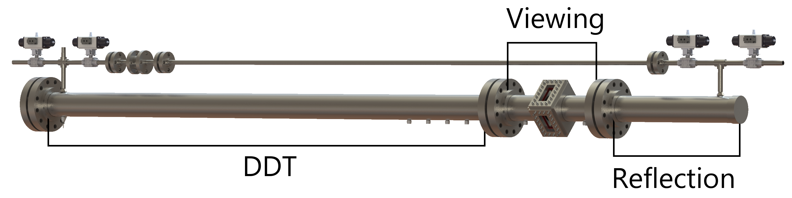

<h1>ME 599 Project Proposal</h1>

<b>Figure 1.</b> CAD rendering of a detonation tube.

The physical study of gaseous detonations requires one to possess a detonation tube such as the one shown in Figure 1. However, there does not, to my knowledge, exist a publicly available set of collected tools to allow for the easy design of such an apparatus. During the design process for my detonation tube, I found myself needing to constantly iterate on my tube's design parameters in order to maximize my tube's effectiveness and safety, while also attempting to adhere to the project's budget. My earliest design efforts used Excel spreadsheets due to the ease with which one can quickly perform a set of calculations. As the design process wore on the various spreadsheets became scattered, convoluted, and error-prone, prompting me to unify all of my analysis in a python script.

The script I wrote was as general as possible; where gas properties were needed, conservative values were used so as not to restrict the analysis to a single combination of gases. Due to the desire for future detonation testing of liquid hydrocarbon fuels, and thus the heating of the tube itself, the script evaluated the maximum allowable stress over a range of temperatures per [ASME B31.1](https://www.asme.org/products/codes-standards/b31-1-2016-power-piping). This was used to calculate the maximum allowable pressure, which was then derated using the dynamic load factor of [Beltman and Shepherd](https://doi.org/10.1006/jsvi.2001.4039). Dynamic load factor is dependent on the material properties and geometry of the tube, as well as the velocity of the detonation front. In an effort to keep the analysis general a range of velocities were evaluated between 1000 and 2500 m/s, as this is a reasonable range in which to expect detonations to propagate.

In a closed detonation tube, the maximum pressure that will be experienced follows the reflection of the detonation wave off of the end wall of the tube. The reflection pressure was set to the maximum allowable value, which was then used to estimate the maximum initial reactant pressure at which detonations could safely occur in the tube. Additionally, the minimum length of the reflection section was calculated such that the viewing windows did not experience increased pressure due to the reflected wave. The safety factor for windows was also calculated from desired window geometry, and the minimum flange class required to withhold the detonation was determined from a lookup table. Lookup tables were also used to calculate factors of safety for the window retainer bolts and the material which they bolt in to. Finally, in order to ensure successful detonation, the diameter and overall length of a Shchelkin-style spiraled blockage were calculated.

Although this analysis was useful, the work was conducted quickly, and without the use of best coding practices. Classes were abused in an effort to group functions together, which has led to some bugs cropping up during repeated calculations. More bugs may exist in the code; not an ounce of unit testing was built in to any of the functions. What I am proposing begins with a ground-up rebuild of this analysis code. The updated version will include unit conversion to prevent possible bugs due to the mixing of unit systems. It will also be rewritten in a more defensive style, so that bugs are caught and prevented _before_ the code is released. Values which were hard-coded into the original script in order to save time will be properly externalized, which will allow for a wider range of materials to be considered by the end-user. Commenting and documentation will be enhanced, especially in areas where their use took a back seat during the original writing.

In addition to rewriting the original analysis code, I am also proposing the inclusion of further functionality. Using cantera and [SDToolbox](http://shepherd.caltech.edu/EDL/public/cantera/html/SD_Toolbox/), the general analysis will be extended to specific gas mixtures to allow for the prediction of mixture-specific safe operation limits. Since this will be taking place in a python 3 environment, I will also be combing through SDToolbox to make it functional in python 3, as well as PEP 8 compliant. This updated version of SDToolbox will be combined with my analysis routines, all of which will be encapsulated into a module which will be deployable using a well-known package repository such as conda or pip. The following is a projected list of packages which may be used, although this list is subject to change during the development cycle:

- cantera
- SDToolbox
- numpy
- matplotlib
- fractions
- sympy
- pandas
- pint

Although this is the extent of my proposed work for this class, I intend for this to be the beginning of a software package which will combine all of the design, testing, and analysis tools that I will build and use during the course of my doctoral research. In addition to the detonation tube design tools outlined in this proposal, the final package will also involve schlieren system design, video analysis for cell size detection, and chemical sensitivity analysis.
